## 개요

클라우드포레에서 Telegram 플러그인을 사용하기 위해서 [BOT API Token], [Chat ID]에 대한 설정이 필요합니다.   
본 설정 가이드는 두 가지 설정 정보를 획득하는 방법을 자세히 알아보도록 하겠습니다.

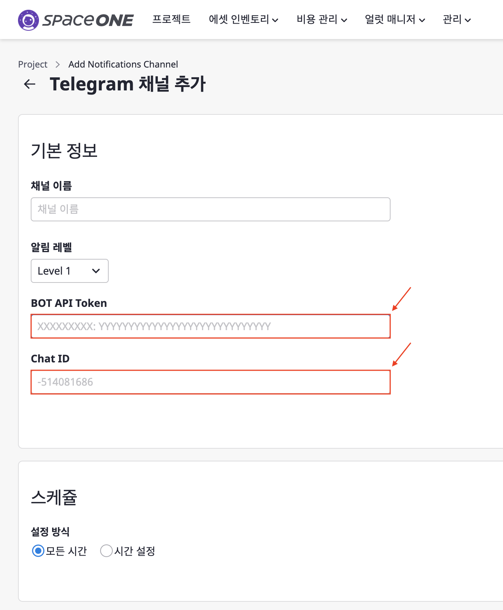

 
 

## 전체 Flow

위의 두 설정을 획득하기 위해 먼저, 전체 Flow를 간략히 알아보도록 하겠습니다.

[1. Bot API Token 획득](./GUIDE.md/#1-bot-api-token-획득)  
[2. Chat ID 획득](./GUIDE.md/#2-chat-id-획득)  
[3. Telegram 연동 후 알림 확인](./GUIDE.md/#3-telegram-연동-후-알림-확인)

먼저 Telegram의 `BotFather`을 사용해 클라우드포레에서 Telegram으로 알람을 보낼 Bot을 생성 합니다.  
이후 일련의 작업을 통해 Bot API Token을 발급 받습니다.  
다음으로 Telegram에서 알림을 받을 그룹을 만들어 봇을 추가 합니다.  
마지막으로 Token을 통해 Chat ID를 획득할 수 있습니다.  
이렇게 획득한 [Bot API Token]과 [Chat ID]를 활용해 클라우드포레에서 Telegram으로 Alert 전달이 가능 합니다.

이제 단계별로 용어 및 설정방법에 대해 상세히 알아보도록 하겠습니다. 순서에 맞게 설정을 진행하시면 됩니다.

 
 

## 1. Bot API Token 획득

`BotFather`는 이름에서 알 수 있듯이 Telegram에서 사용되는 Bot의 생성, 삭제 그리고 관리를 관여하는 하나의 Bot 입니다.  
`BotFather`을 통해 클라우드포레의 알림을 받기 위해 `CloudForet_to_Telegram_bot`을 만들고 Bot API Token을 발급 받는 과정을 알아보도록 하겠습니다.

(1) Telegram 로그인 > [Search]에 BotFather을 검색 합니다.

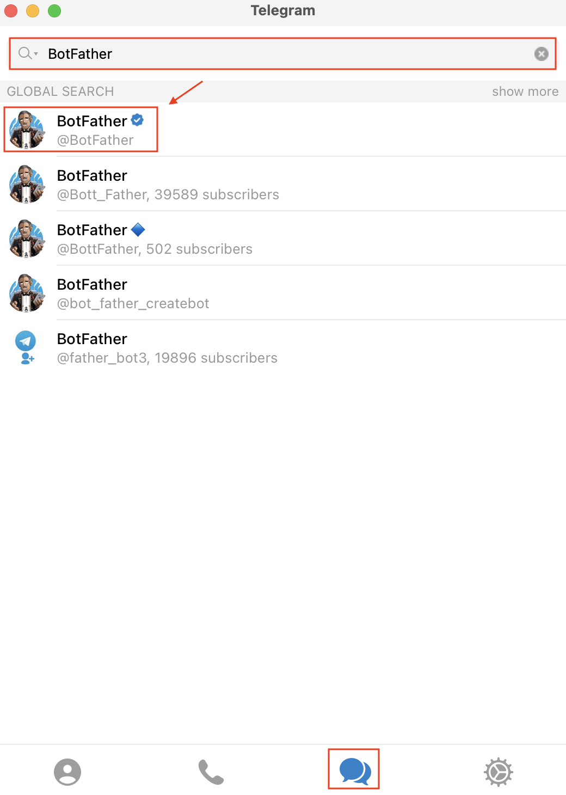

(2) [BotFather] 을 클릭하고 [start]버튼을 클릭합니다.  
&nbsp;&nbsp;&nbsp;&nbsp;&nbsp;`/start` 명령어가 자동으로 입력된 것을 확인할 수 있습니다.  
&nbsp;&nbsp;&nbsp;&nbsp;&nbsp;BotFather는 아래 그림에서 볼 수 있듯이 지정된 명령어 기반으로 작동합니다.  
&nbsp;&nbsp;&nbsp;&nbsp;&nbsp;먼저 `/newbot` 을 통해 봇을 생성해 보겠습니다.

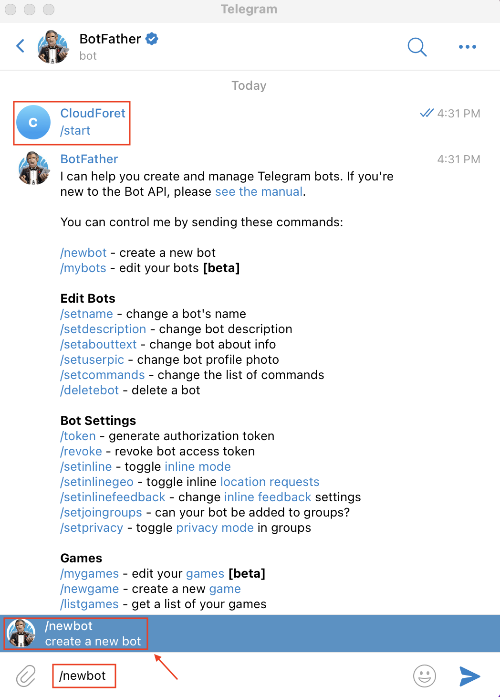

(3) 먼저, Telegram에서 사용할 Bot의 [name]을 입력 합니다.  
&nbsp;&nbsp;&nbsp;&nbsp;&nbsp;예시는 `CloudForet_to_Telegram_bot` 이 name 입니다.  
&nbsp;&nbsp;&nbsp;&nbsp;&nbsp;다음으로 [username]을 입력 합니다.  
&nbsp;&nbsp;&nbsp;&nbsp;&nbsp;예시는 `CloudForet_notification_bot`이 username 입니다.  
&nbsp;&nbsp;&nbsp;&nbsp;&nbsp;중요한 점은 [username]은 반드시 `bot` 으로 끝나야 합니다.  
&nbsp;&nbsp;&nbsp;&nbsp;&nbsp;[name]과 [username] 입력이 완료되면 [Bot API Token]을 획득할 수 있습니다.  
&nbsp;&nbsp;&nbsp;&nbsp;&nbsp;아래 `빨간색 글씨`가 클라우드포레에서 입력해야하는 [Bot API Token]입니다.

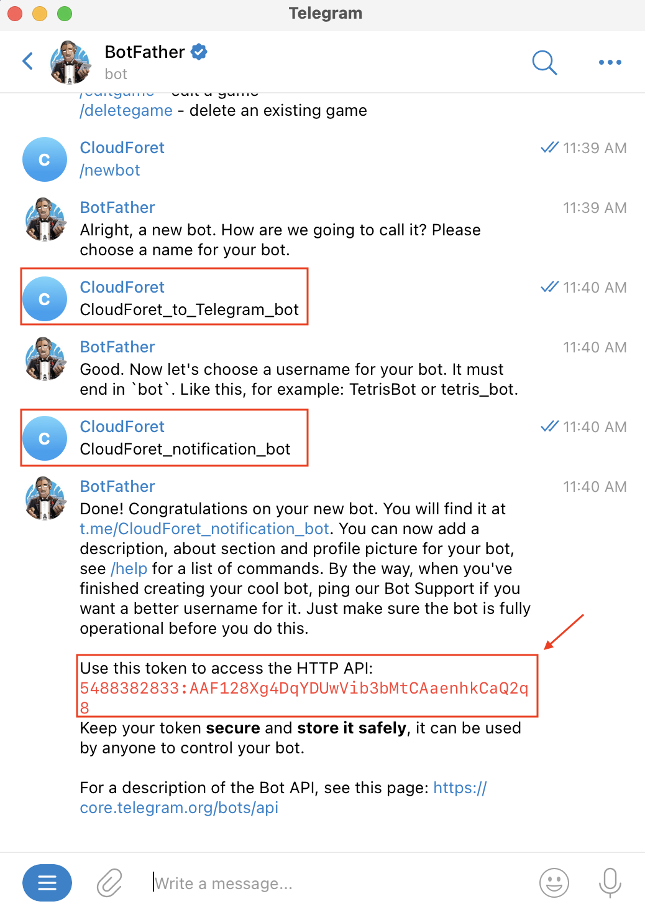

위 단계를 통해 [Bot API Token]을 획득 하였습니다.  
이제 [Chat ID]를 획득하기 위해 세부 설정 방법을 알아보겠습니다. 

 
 

## 2. Chat ID 획득

Telegram에서 채팅방은 [Group] 단위로 구분하게 됩니다.  
먼저, 클라우드포레로 부터 알림을 받을 Group에 [1. Bot API Token 획득](./GUIDE.md/#1-bot-api-token-획득)에서 획득한 Bot을 추가해보도록 하겠습니다.  
가이드는 사용자의 특정 Group이 있다고 가정하고 시작합니다.

(1) [더 보기] 클릭 > [info]을 클릭하여 Group의 정보를 확인 합니다.

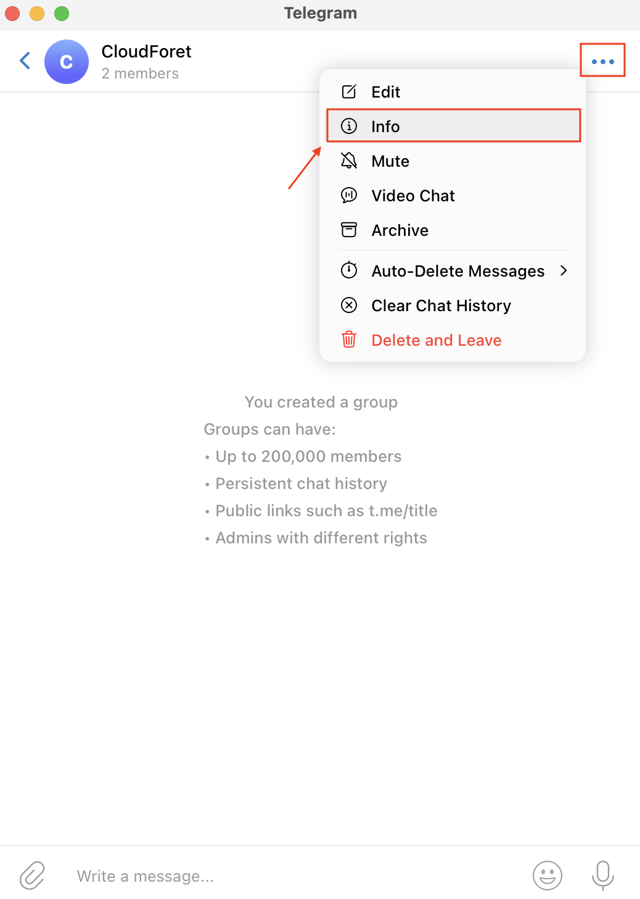

(2) [info]에서 Group 멤버를 추가할 수 있습니다.  
&nbsp;&nbsp;&nbsp;&nbsp;&nbsp;[Add] 버튼을 클릭하면 [Add Members] 모달이 나타납니다. 이전에 생성한 Bot을 검색한 뒤 멤버로 추가 합니다.

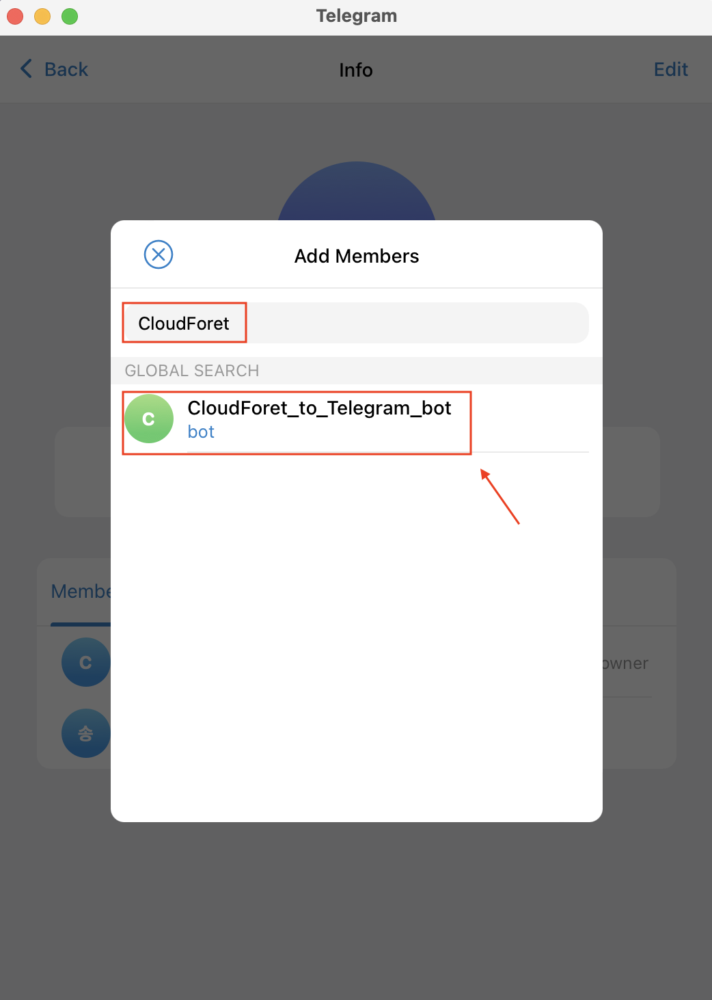

(2-1) 이전에 생성한 Bot인 `CloudForet_to_Telegram` 이 추가된 것을 확인할 수 있습니다.

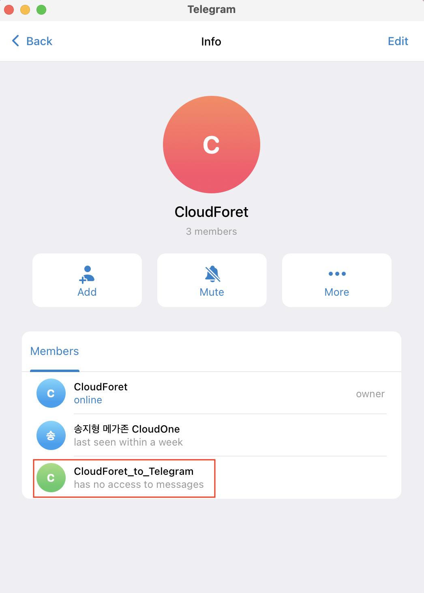

(2-2) (3)을 진행하기 앞 서 가장 중요한 것은 Bot을 추가한 뒤 **1개 이상의 메세지를 채팅방**에 보내야 합니다.  
&nbsp;&nbsp;&nbsp;&nbsp;&nbsp;&nbsp;&nbsp;&nbsp;&nbsp;또한 `/start {Bot API Token}` 명령어를 채팅방에 입력해야 합니다.

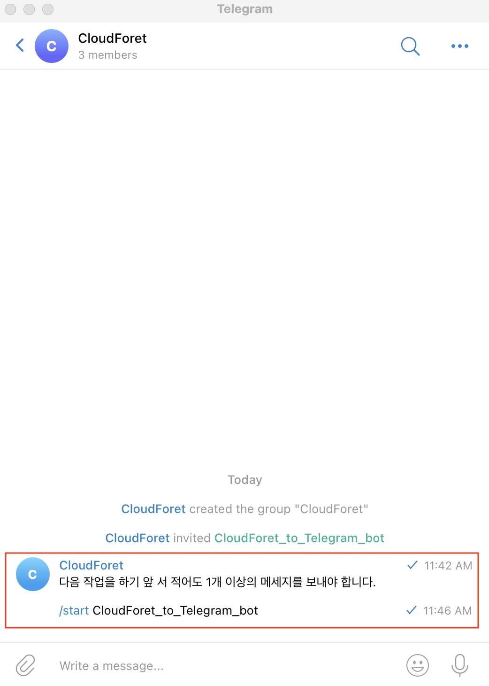

(3) [1. Bot API Token 획득](./GUIDE.md/#1-bot-api-token-획득)에서 획득한 Token을 사용해  
&nbsp;&nbsp;&nbsp;&nbsp;&nbsp;브라우저를 사용해`https://api.telegram.org/bot{Bot API Token}/getUpdates` URL로 접속 후 Chat ID를 획득해 보겠습니다.    
&nbsp;&nbsp;&nbsp;&nbsp;&nbsp;예시에서 Bot API Token은 `5488382833:AAF128Xg4DqYDUwVib3bMtCAaenhkCaQ2q8`입니다.   
&nbsp;&nbsp;&nbsp;&nbsp;&nbsp;따라서 대상이 되는 URL은 `https://api.telegram.org/bot5488382833:AAF128Xg4DqYDUwVib3bMtCAaenhkCaQ2q8/getUpdates` 입니다.

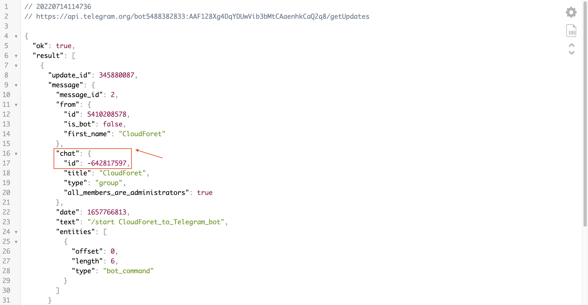

이제, 클라우드포레에서 기입해야하는 정보인 [Chat ID]를 획득할 수 있습니다.  
반드시 **`-` 기호를 포함하는 ID** 입니다. 또한 `-`를 포함하지 않는 Chat ID를 획득하는 경우도 있습니다.

 
 

## 3. Telegram 연동 후 알림 확인

준비는 끝났습니다. 클라우드포레에서 Telegram 알람을 받을 수 있도록 연동해보고 Alert을 발생시켜 확인 해보겠습니다.

(1) 획득한 [Bot API Token]과 [Chat ID]를 기입 합니다.

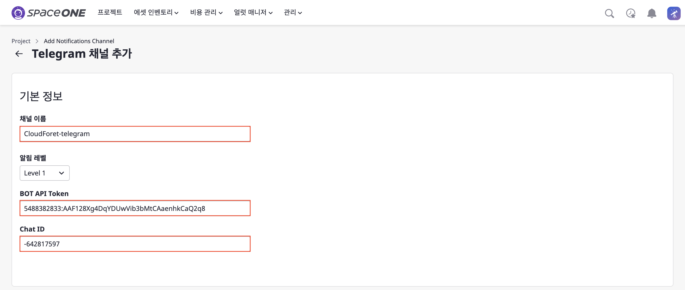

(2) [알림 채널]에 [Telegram]이 설정된 것을 확인할 수 있습니다.

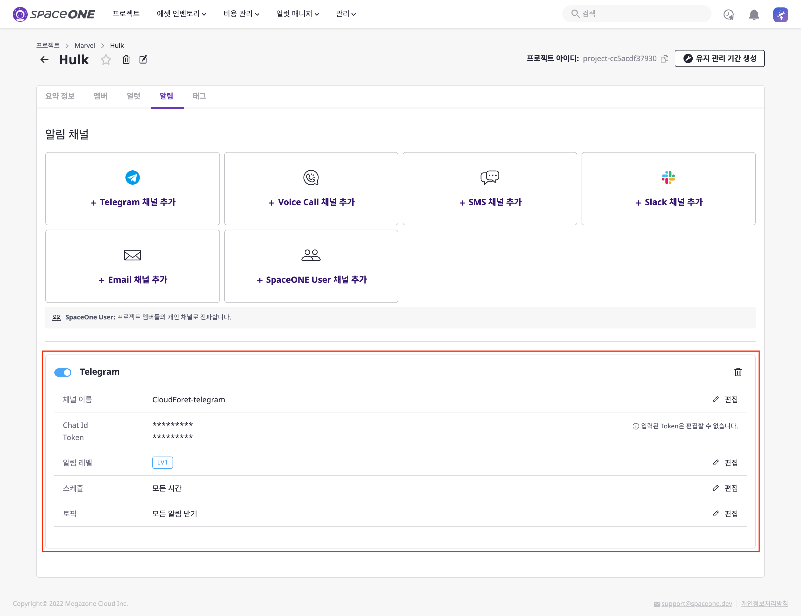

(3) 연동이 잘 되었는지 클라우드포레에서 샘플 Alert을 발생 시킨 후 Telegram에서 확인 합니다.

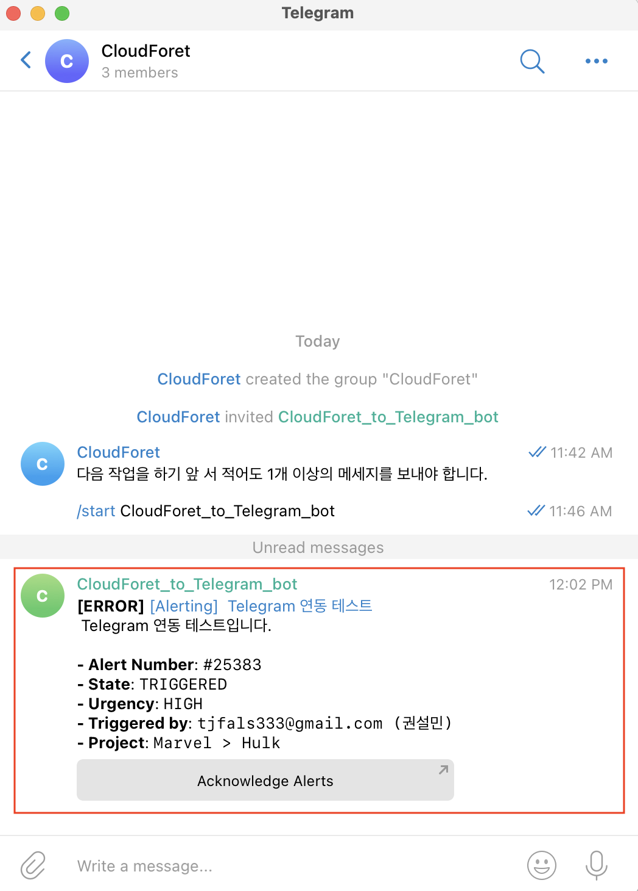

클라우드포레와 Telegram의 연동 방법을 알아 보았습니다.